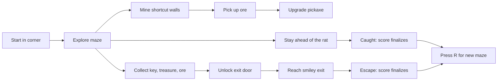

# Monkey Miner

Monkey Miner is a small 3D maze game built with Rust and Bevy. You play a miner monkey trapped inside a randomly generated, Windows 3D Maze-inspired labyrinth. Find the smiley exit, collect what you can, mine shortcuts, and do not let the rat catch you.


## Current Game

Each run starts in one corner of a connected maze. The exit is in the far corner, but the path is blocked by a locked door. A key spawns near the start. Treasures and chests are scattered through dead ends. Internal walls can be mined to create shortcuts or escape routes.

The maze is randomized every time you restart a run.



## Example Maze Layout

The real maze is larger and generated at runtime, but a run starts with this kind of structure. The player begins near one corner, the exit is far away, and the door/key placement forces at least a little exploration before escape.

```text
#############
#P..K#.....T#
###..#.###..#
#....#...#..#
#.######.#D##
#T....C#.#G.#
#.####.#.####
#....#.#....#
####.#.###R.#
#..T.#......#
#############
```

Legend:

| Mark | Meaning |
| --- | --- |
| `#` | Wall |
| `.` | Walkable corridor |
| `P` | Player start |
| `K` | Key spawn near start |
| `D` | Locked door before the exit |
| `G` | Smiley exit goal |
| `R` | Rat enemy |
| `T` | Treasure |
| `C` | Chest |

## Controls

| Input | Action |
| --- | --- |
| `W` / `S` | Move forward / backward |
| `A` / `D` | Strafe left / right |
| Mouse drag | Orbit camera |
| `Q` / `E` | Turn camera left / right |
| `T` | Drop a trail marker in the current maze cell |
| `F` | Mine the wall you are facing |
| `U` | Open / close upgrade menu |
| `Up` / `Down` | Select upgrade while the menu is open |
| `Enter` / `Space` | Buy selected upgrade while the menu is open |
| `Esc` | Close upgrade menu |
| `R` | Restart after winning or getting caught |

## Mining And Upgrades

Mining consumes energy. If energy hits zero, upgrade mining with ore to keep opening shortcuts. Ore can also be spent on movement speed if you want a faster escape route instead.

Upgrade rules:

| Upgrade | Cost | Effect |
| --- | --- | --- |
| Mining energy | Current mining level in ore | Mining level +1, max energy +1, energy refills, mined walls drop more ore |
| Movement speed | Current speed level in ore | Speed level +1, movement speed increases |

## Scoring

Score updates during the run and finalizes when you escape or get caught.

| Event | Points |
| --- | ---: |
| Treasure | 100 |
| Ore held | 25 |
| Key held | 20 |
| Door unlocked | 150 |
| Chest opened | 75 |
| Wall mined | 10 |
| Escape bonus | 1000 |
| Time | -1 point per second |

The HUD shows current score and best score for the current process.

## Run From Source

Requirements:

| Tool | Version |
| --- | --- |
| Rust | Stable, from `rust-toolchain.toml` |
| Cargo | Installed with Rust |

Run the development build:

```sh
cargo run
```

Run the release build through the local launcher:

```sh
bin/monkey-miner
```

The launcher builds `target/release/monkey-miner` if it does not already exist, then runs it.

You can also use Make targets if `make` is installed:

```sh
make run
make check
make package
```

## Build A Packaged Executable

Create a local macOS/Linux package with the executable and assets copied together:

```sh
scripts/build-release.sh
```

The script writes a platform-specific directory under `dist/`, for example:

```sh
dist/monkey-miner-darwin-x86_64/monkey-miner
```

Run the packaged executable from inside that directory:

```sh
cd dist/monkey-miner-darwin-x86_64
./monkey-miner
```

The executable also looks for `assets/` next to itself, so launching it by full path works too:

```sh
dist/monkey-miner-darwin-x86_64/monkey-miner
```

### Windows `.exe`

Build the Windows executable on a Windows machine with Rust installed:

```powershell
powershell -ExecutionPolicy Bypass -File scripts\build-release.ps1
```

That creates:

```powershell
dist\monkey-miner-windows-x86_64\monkey-miner.exe
```

Run it with:

```powershell
dist\monkey-miner-windows-x86_64\monkey-miner.exe
```

There is also a Makefile target for environments that have both `make` and PowerShell:

```sh
make package-windows
```

For this Bevy prototype, native packaging is the reliable path. Cross-compiling a Windows `.exe` from macOS is possible in theory, but it usually requires extra linker and Windows SDK setup that is not worth baking into this repo yet.

`dist/` is ignored because it is generated output and the release binary is large.

## Project Layout

| Path | Purpose |
| --- | --- |
| `src/main.rs` | Gameplay systems, camera, HUD, pickups, rat, mining, scoring |
| `src/maze.rs` | Maze generation, maze geometry, wall data, fog cells |
| `assets/images/` | Pixel art textures and sprites |
| `assets/audio/` | Short 8-bit sound effects |
| `assets/icons/` | App icon source plus `.ico` and `.icns` outputs |
| `bin/monkey-miner` | Local release launcher |
| `scripts/build-release.sh` | Packaged executable builder |
| `scripts/build-release.ps1` | Windows `.exe` package builder |
| `Makefile` | Convenience targets for run/check/package |
| `docs/screenshots/` | README screenshots |

## Notes

This is still a prototype. The core loop works: explore, collect, mine, upgrade, unlock, escape, or restart after the rat catches you.
