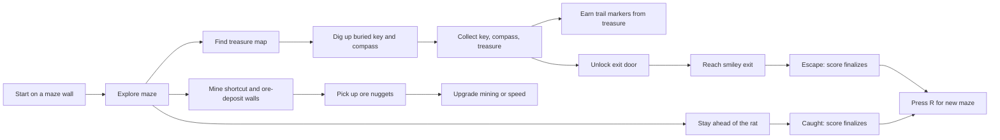

# Monkey Miner

Monkey Miner is a small 3D maze game built with Rust and Bevy. You play a miner monkey trapped inside a randomly generated, Windows 3D Maze-inspired labyrinth. Find the smiley exit, collect what you can, mine shortcuts, and do not let the rat catch you.


## Current Game

Each run starts along one wall of a connected maze. The exit is in the far corner, but the path is blocked by a locked door. The treasure map spawns after an early fork, out of sight from that fork. After you find it, the map reveals pulsing yellow dig spots with red X marks for the buried key and compass. Mine those glowing cells to launch the pickups out of the ground; they bounce and become collectible after landing. Treasures, chests, and ore-deposit walls are scattered through the maze. Mine internal walls to create shortcuts or escape routes, but boundary walls are unbreakable.

The maze is randomized every time you restart a run. The rooms are intentionally roomy, but fog, the roof, the rat, and limited resources keep the route tense.



## Example Maze Layout

The real maze is generated at runtime, but a run uses this 18x18-cell scale. The player begins on a random wall cell away from the exit corner, the first fork appears after a short entrance corridor, and both first-fork branches lead onward to more forks. This captured debug layout shows the actual wall grid for one generated run, annotated with representative pickup, treasure, ore, rat, buried-target, and hard-wall markers.

```text
##################################XXX
#.........#.#P#.......#...#.......DG#
###.#####.#.#.#.###.###.#.#.#####.XXX
#.C.#...#.#.#.#...#..T..#...#.....#.#
#.###.###.#.#.#############.#.#####.#
#...#...#...#...T...#.....#.#.#...#.#
###.#.#.#.#########.#.#.###.#.#.#.#.#
#...#.#...#.....#.....#.#...#.#.#...#
#.###.#####.###.#.###########.#.#####
#.#...#..T..#.....#...........#.....#
#.###O#.#######.###.###########.#####
#.......#..?..#.#...#...#.......#...#
#.#######.#.#.#####.#.#.#.#######.#.#
#.#.....#.#.#.#.....#.#.#.#.....#.#.#
#.#.###.#.#.#.#.#.###.###.#.#####.#.#
#.#.#.#.#.#.#.#.#.#.#...T...#.....#.#
#.#.#.#.###.###.#.#.#.#######.#####.#
#...#.#...#...#.#.#R......#@......#.#
#####.###.#.#.#.#.#######.#.#######.#
#...*...#.#.#...#...#.....#...#.....#
#.###.###.#.#######.#.#######.#.###.#
#.#.#..C..#.#.....#.#.......#.#...#.#
#.#.#######.#####.#.#.###.###.#.###.#
#...#.....#..C..#.#...#.#.#...#.#.#.#
###.#.#O#######.#.#####.#.#.###.#.#.#
#.#.#.#...T...#.#.......#.#.#.#.#...#
#.#.#.###.#.###.#######.#.#.#.#.#.###
#.#.#...#.#.#...........#.#K..#.#...#
#.#.###.#.###.###########.###.#.###.#
#...#...#..C..#...#.....#.....#.#...#
#.#############.#.#.###O#.#####.#.###
#.....*.........#.#.#...#.#.....#...#
#################.#.#.#####.###O###.#
#.#.........#.....#.#...#...#.....#.#
#.#.###.#####.#####.###.#.###.###.#.#
#..C..#.....T.......#.....#.....#...#
#####################################
```

Legend:

| Mark | Meaning |
| --- | --- |
| `#` | Wall |
| `.` | Walkable corridor |
| `P` | Player start |
| `K` | Key after it has been dug up and collected |
| `D` | Locked door before the exit |
| `G` | Smiley exit goal |
| `R` | Rat enemy |
| `T` | Treasure |
| `C` | Chest |
| `O` | Ore-deposit wall |
| `?` | Treasure map pickup |
| `*` | Buried key/compass dig spot, shown in-game as a pulsing yellow glow with a red X |
| `@` | Compass after it has been dug up and collected |
| `X` | Hard goal-area wall requiring 5 mining hits, or an unbreakable boundary wall |

## Controls

| Input | Action |
| --- | --- |
| `W` / `S` | Move forward / backward |
| `A` / `D` | Strafe left / right |
| Click game window | Capture/hide cursor for mouse-look camera control |
| Mouse movement | Turn camera while cursor is captured |
| `Esc` | Release cursor while it is captured |
| `Q` / `E` | Turn camera left / right |
| `T` | Drop a trail marker in the current maze cell, if you have one |
| `F` | Mine the wall you are facing |
| `R` | Open / close upgrade menu during a run; restart after winning or getting caught |
| `M` | Open / close treasure map after finding it |
| `1` / `2` | Select upgrade while the menu is open |
| `Up` / `Down` | Select upgrade while the menu is open |
| `Space` | Buy selected upgrade while the menu is open |

## Mining And Upgrades

Mining consumes energy. If energy hits zero, upgrade mining with ore to keep opening shortcuts. Ore comes from chests and special ore-deposit walls. Normal walls do not drop ore, and boundary walls cannot be mined.

Ore-deposit walls burst into bouncing nuggets. Nuggets settle before they can be collected, and bounce off maze walls instead of passing through them.

Ore can also be spent on movement speed if you want a faster escape route instead.

Upgrade rules:

| Upgrade | Cost | Effect |
| --- | --- | --- |
| Mining energy | Current mining level in ore | Mining level +1, max energy +1, energy refills |
| Movement speed | Current speed level in ore | Speed level +1, movement speed increases |

## Navigation Tools

You start with 5 trail markers. Dropping a marker spends 1 marker and marks the current cell. Each loose treasure adds 2 more markers.

The treasure map is a world pickup, and the key/compass are buried until the map reveals them:

| Tool | Behavior |
| --- | --- |
| Treasure map | Toggle with `M` after pickup. It shows separate arrows to the buried key and buried compass. |
| Buried key/compass | Pulsing yellow glow with a red X in a maze cell. Stand on the glow and press `F` to dig up the pickup. It bounces before becoming collectible. |
| Compass | After you dig up and collect it, shows an exit arrow. The arrow is red until you have the key, then green. |

## Scoring

Score updates during the run and finalizes when you escape or get caught.

| Event | Points |
| --- | ---: |
| Treasure | 100 |
| Ore held | 25 |
| Key held | 20 |
| Door unlocked | 150 |
| Chest opened | 75 |
| Wall mined | 10 |
| Escape bonus | 1000 |
| Time | -1 point per second |

The HUD shows current score and best score for the current process.

## Run From Source

Requirements:

| Tool | Version |
| --- | --- |
| Rust | Stable, from `rust-toolchain.toml` |
| Cargo | Installed with Rust |

Run the development build:

```sh
cargo run
```

Run the release build through the local launcher:

```sh
bin/monkey-miner
```

The launcher builds `target/release/monkey-miner` if it does not already exist, then runs it.

You can also use Make targets if `make` is installed:

```sh
make run
make check
make package
```

## Build A Packaged Executable

Create a local macOS/Linux package with the executable and assets copied together:

```sh
scripts/build-release.sh
```

The script writes a platform-specific directory under `dist/`, for example:

```sh
dist/monkey-miner-darwin-x86_64/monkey-miner
```

Run the packaged executable from inside that directory:

```sh
cd dist/monkey-miner-darwin-x86_64
./monkey-miner
```

The executable also looks for `assets/` next to itself, so launching it by full path works too:

```sh
dist/monkey-miner-darwin-x86_64/monkey-miner
```

### Windows `.exe`

From macOS/Linux, install the Windows Rust target and MinGW linker, then package the Windows build:

```sh
rustup target add x86_64-pc-windows-gnu
brew install mingw-w64
make package-windows
```

That creates:

```sh
dist/monkey-miner-windows-x86_64/monkey-miner.exe
```

You can also build the Windows executable natively on a Windows machine with Rust installed:

```powershell
powershell -ExecutionPolicy Bypass -File scripts\build-release.ps1
```

That creates:

```powershell
dist\monkey-miner-windows-x86_64\monkey-miner.exe
```

Run it with:

```powershell
dist\monkey-miner-windows-x86_64\monkey-miner.exe
```

The macOS/Linux cross-build uses the GNU Windows target. If the command fails before building, install whichever prerequisite the script reports as missing.

`dist/` is ignored because it is generated output and the release binary is large.

## Project Layout

| Path | Purpose |
| --- | --- |
| `src/main.rs` | Gameplay systems, camera, HUD, pickups, rat, mining, scoring |
| `src/maze.rs` | Maze generation, maze geometry, wall data, fog cells |
| `assets/images/` | Pixel art textures and sprites |
| `assets/audio/` | Short 8-bit sound effects |
| `assets/icons/` | App icon source plus `.ico` and `.icns` outputs |
| `bin/monkey-miner` | Local release launcher |
| `scripts/build-release.sh` | Packaged executable builder |
| `scripts/build-release.ps1` | Windows `.exe` package builder |
| `Makefile` | Convenience targets for run/check/package |
| `docs/screenshots/` | README screenshots |

## Notes

This is still a prototype. The core loop works: explore, collect, place markers, mine, upgrade, unlock, escape, or restart after the rat catches you.
